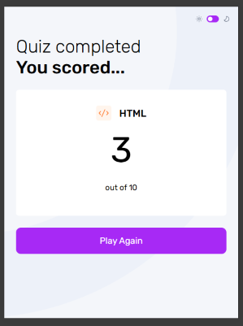

## Welcome to the Frontend Quiz

This is a web application that tests a users knowledge of several subjects that are integral to frontend development.

## Main Menu

Select a subject from the main menu, and you will be brought to the quiz screen.

## Quiz

Select your answer to the question and press the submit button.

If your answer is incorrect, the quiz will highlight both the incorrect answer and the correct answer.

If your answer is correct, your answer will be highlighted in green.

In either case, the user can press the button to reveal the next question.

If no answer is selected before pressing submit, an error message will be presented.

## Quiz Complete

Once the user has answered all questions, a completed quiz screen will be revealed, and the user's score will be displayed.
From here, the user can select "Play Again" to return to the main menu.

## Dark Mode

At any time, the switch in the upper right hand corner of the screen can be selected to toggle dark or light mode.

